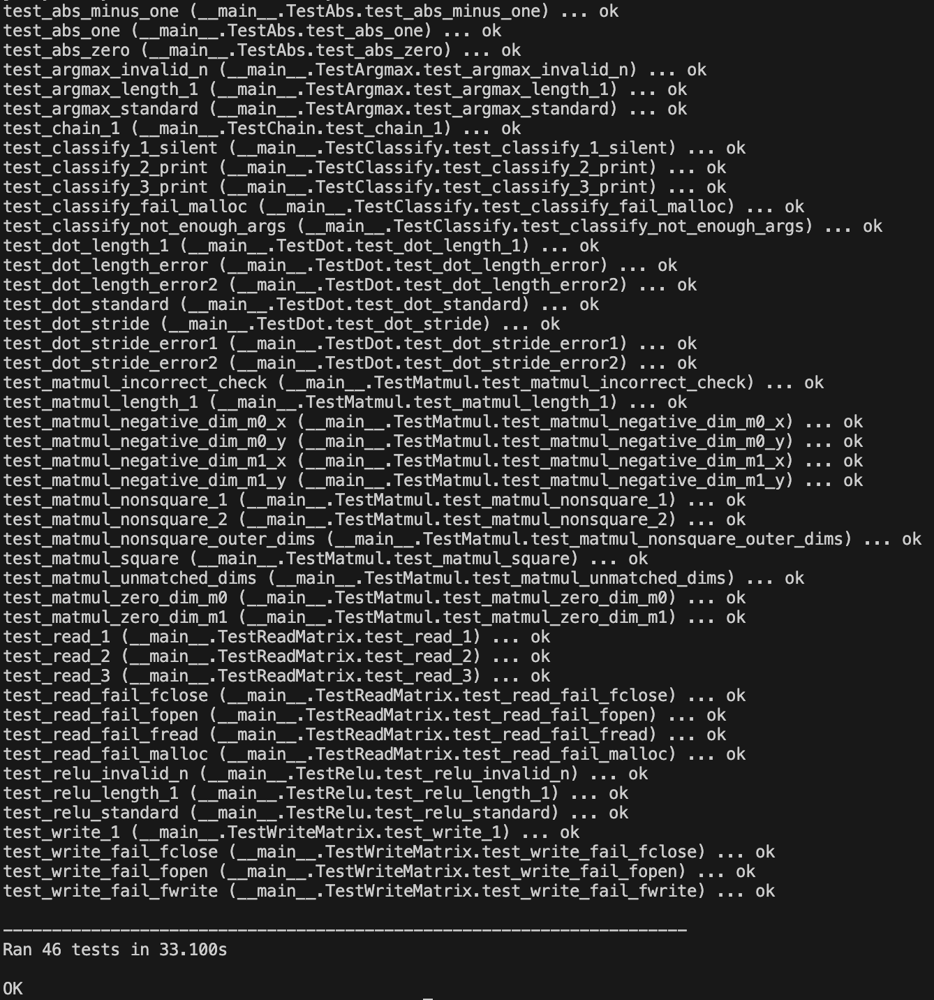

# Assignment 2: Classify

## Part A
### Task 1: ReLU
In the `relu.s` file, the goal is to implement the **ReLU** (Rectified Linear Unit) activation function, defined as:
$$
\text{ReLU}(a) = \max(a, 0)
$$
This function processes each element of the input array individually by replacing any negative value with 0 while retaining non-negative values unchanged. As the matrix is stored as a 1D row-major vector, the ReLU function operates directly on the flattened array representation.

**Complete Code**
```ass=
relu:
    li t0, 1             
    blt a1, t0, error     
    li t1, 0             

    mv t3, a0
loop_start:
    beq t1, a1, end
    lw t4, 0(t3)
    bltz t4, zero_value
    j loop_next

zero_value:
    sw zero, 0(t3)

loop_next:
    addi t3, t3, 4
    addi t1, t1, 1
    j loop_start

end:
    ret

error:
    li a0, 36          
    j exit          
```

**1. Setup and Error Handling**
```ass
li t0, 1             
blt a1, t0, error     
li t1, 0             
```
* Loads the value 1 into register `t0` to be used as a minimum array length check.
* Checks if `a1` (which presumably holds the array length) is less than 1. If so, it jumps to the error label, as processing an empty array is invalid.
* Initializes `t1` to 0, which will be used as a loop counter.

**2.	Initialize Pointer to Array and Begin Loop**
```ass
mv t3, a0
loop_start:
    beq t1, a1, end
```
* Copies the base address of the array (from `a0`) into `t3`, which acts as a pointer to iterate through the array.
* Compares the counter `t1` with `a1` (array length). If they are equal, it means the loop has processed all elements, and it jumps to the `end` label to exit the loop.

**3.	Load Current Element and Check if Negative**
```ass
lw t4, 0(t3) 
bltz t4, zero_value
j loop_next
```
* Loads the current array element into register `t4`.
* Checks if the value in `t4` is negative. If it is, the code jumps to the `zero_value` label to set the value to zero.
* If the value is not negative, the code skips to `loop_next` to continue to the next element.

**4.	Set Negative Value to Zero**
```ass
zero_value:
    sw zero, 0(t3)
```
* Stores 0 (using the zero register) at the current array location, effectively replacing the negative value with 

**5.	Advance to Next Array Element**
```ass
loop_next:
    addi t3, t3, 4
    addi t1, t1, 1
    j loop_start
```
* Increments `t3` by 4 to point to the next array element (assuming each element is 4 bytes).
* Increments the counter `t1` by 1.
* Jumps back to loop_start to process the next element.
### Task 2: ArgMax
In the `argmax.s` file, the objective is to implement the **argmax** function, which identifies the index of the maximum element in a given 1D vector. If multiple elements share the maximum value, the function should return the smallest index among them. The implementation assumes that the input data is provided as a one-dimensional vector.

**Complete Code**
```ass
argmax:
    li t6, 1
    blt a1, t6, handle_error

    lw t0, 0(a0)

    li t1, 0
    li t2, 1            # Current index
loop_start:
    beq t2, a1, end
    addi a0, a0, 4
    lw t3, 0(a0)
    bge t3, t0, set_max_num
    addi t2, t2, 1
    j loop_start

set_max_num:
    addi t2, t2, 1
    beq t3, t0, loop_start
    mv t1, t2
    addi t1, t1, -1
    mv t0, t3
    j loop_start

end:
    mv a0, t1
    ret

handle_error:
    li a0, 36
    j exit
```

**1. Initialize Variables:**
```ass
    lw t0, 0(a0)

    li t1, 0
    li t2, 1            # Current index
```
* Load the first element of the vector (pointed to by `a0`) into `t0` as the current maximum value.
* Set `t1` to 0, representing the index of the current maximum.
* Initialize `t2` to 1, the next index to process.

**2.	Iterate Over the Vector:**
```ass
loop_start:
    beq t2, a1, end
    addi a0, a0, 4
    lw t3, 0(a0)
    bge t3, t0, set_max_num
    addi t2, t2, 1
    j loop_start
```
* At `loop_start`, compare `t2` (current index) with `a1` (size of the vector). If equal, jump to `end`.
* Increment `a0` by 4 to point to the next element.
* Load the value of the current element into `t3`.
* Compare `t3` with t0 (current maximum value). If `t3` >= `t0`, jump to `set_max_num`.
* If not, increment `t2` (current index) and loop back to `loop_start`.

**3.	Update Maximum:**
```ass
set_max_num:
    addi t2, t2, 1
    beq t3, t0, loop_start
    mv t1, t2
    addi t1, t1, -1
    mv t0, t3
    j loop_start
```
* Increment `t2` (current index).
* If `t3` equals `t0`, skip updating and loop back to `loop_start` to ensure ties keep the smallest index.
* Otherwise, set `t1` to `t2` - 1 (index of the new maximum).
* Update `t0` with the new maximum value (`t3`) and continue the loop.

**4.	Finish Execution:**
```ass
end:
    mv a0, t1
    ret
```
* At end, move the index of the maximum value (`t1`) into `a0` as the return value.
* Return to the caller.

### Task 3.1: Dot Product
In `dot.s`, the objective is to implement the `dot product` function, defined as:
$$
\text{dot}(a, b) = \sum_{i=0}^{n-1} (a_i \cdot b_i)
$$

**Complete Code**
```ass=
dot:
    li t0, 1
    blt a2, t0, error_terminate  
    blt a3, t0, error_terminate   
    blt a4, t0, error_terminate  

    li t0, 0            
    li t1, 0         

loop_start:
    bge t1, a2, loop_end
    lw t2, 0(a0)
    lw t3, 0(a1)

mul:
    li t4, 0
    bge t2, zero, mul_loop_t2
    bge t3, zero, mul_loop_t3
    neg t2, t2
    neg t3, t3 

mul_loop_t2:
    beq t2, zero, mul_end
    add t4, t4, t3
    addi t2, t2, -1
    j mul_loop_t2

mul_loop_t3:
    beq t3, zero, mul_end
    add t4, t4, t2
    addi t3, t3, -1
    j mul_loop_t3

mul_end:
    add t0, t0, t4
    addi t1, t1, 1
    mv t5, zero
    
a0_stride:
    addi a0, a0, 4
    addi t5, t5, 1
    blt t5, a3, a0_stride
    mv t5, zero

a1_stride:
    addi a1, a1, 4
    addi t5, t5, 1
    blt t5, a4, a1_stride
    j loop_start

loop_end:
    mv a0, t0
    jr ra

error_terminate:
    blt a2, t0, set_error_36
    li a0, 37
    j exit

set_error_36:
    li a0, 36
    j exit
```
Steps to implement Dot Product

**1. Start of the Loop**
```ass
loop_start:
    bge t1, a2, loop_end
    lw t2, 0(a0)
    lw t3, 0(a1)
```
* **Condition Check:** If `t1` (current iteration count) is greater than or equal to `a2` (number of elements in the vectors), jump to `loop_end` to exit the loop.
* **Load Elements:**
	* Load the current element from the vector pointed to by `a0` into `t2`.
	* Load the corresponding element from the vector pointed to by `a1` into `t3`.
	
**2. Begin Multiplication**
```ass
mul:
    li t4, 0
    bge t2, zero, mul_loop_t2
    bge t3, zero, mul_loop_t3
    neg t2, t2
    neg t3, t3 
```
* Initialize Result: Set `t4` to 0, which will store the product of `t2` and `t3`.
* Check Signs:
	* If `t2` is non-negative, skip to `mul_loop_t2`.
	* If `t3` is non-negative, skip to `mul_loop_t3`.
	* If either value is negative, negate it to ensure multiplication is done with positive values.

**3. Multiply Using Repeated Addition (First Operand Loop)**
```ass
mul_loop_t2:
    beq t2, zero, mul_end
    add t4, t4, t3
    addi t2, t2, -1
    j mul_loop_t2
```
* Loop for `t2`:
    * If `t2` equals zero, jump to `mul_end`.
	* Add `t3` to `t4` repeatedly, decrementing `t2` after each addition.
	* Continue until `t2` becomes zero.

**4. Multiply Using Repeated Addition (Second Operand Loop)**
```ass
mul_loop_t3:
    beq t3, zero, mul_end
    add t4, t4, t2
    addi t3, t3, -1
    j mul_loop_t3
```
* Loop for `t3`:
	* If `t3` equals zero, jump to `mul_end`.
	* Add `t2` to `t4` repeatedly, decrementing `t3` after each addition.
	* Continue until `t3` becomes zero.

**5. End of Multiplication**
```ass
mul_end:
    add t0, t0, t4
    addi t1, t1, 1
    mv t5, zero
```
* **Update Accumulated Result:** Add the computed product (`t4`) to the running total in `t0`.
* **Increment Counter:** Increment `t1` to process the next pair of elements.
* **Reset Stride Counter:** Set `t5` to 0 to prepare for pointer adjustments.

**6. Advance Pointer `a0`**
```ass
a0_stride:
    addi a0, a0, 4
    addi t5, t5, 1
    blt t5, a3, a0_stride
    mv t5, zero
```
* **Adjust Pointer:** Move `a0` forward by the stride size (`a3` specifies the stride).
* **Repeat Until Full Stride:** Continue until the pointer has advanced by `a3` elements.
* **Reset Counter:** Set `t5` to 0 for the next stride operation.

**7. Advance Pointer `a1`**
```ass
a1_stride:
    addi a1, a1, 4
    addi t5, t5, 1
    blt t5, a4, a1_stride
    j loop_start
```
* Adjust Pointer: Move `a1` forward by the stride size (`a4` specifies the stride).
* Repeat Until Full Stride: Continue until the pointer has advanced by `a4` elements.
* Loop Continuation: Jump back to `loop_start` to process the next pair of elements

### Task 3.2: Matrix Multiplication
In `matmul.s`, the objective is to implement matrix multiplication, where:
$$
C[i][j] = \text{dot}(A[i], B[:,j])
$$

The following code is the part we need to implement:
```ass
inner_loop_end:
    addi s0, s0, 1
    li t0, 0
    
mul_start:
    addi s3, s3, 4 # incrementing the row on Matrix A
    addi t0, t0, 1
    blt t0, a2, mul_start
    j outer_loop_start

outer_loop_end:
    lw ra, 0(sp)
    lw s0, 4(sp)
    lw s1, 8(sp)
    lw s2, 12(sp)
    lw s3, 16(sp)
    lw s4, 20(sp)
    lw s5, 24(sp)
    addi sp, sp, 28
    ret
```
**1. End of the Inner Loop**
```ass
inner_loop_end:
    addi s0, s0, 1
    li t0, 0
```
* **Increment Outer Loop Counter (`s0`):** After completing the inner loop (processing all columns of matrix B for a specific row of matrix A), increment the outer loop counter `s0`, which tracks the current row of matrix A being processed.
* **Reset `t0`:** Initialize `t0` to 0. This will be used in the next loop to count the columns of matrix A.

**2. Adjust Row Pointer for Matrix A**
```ass
mul_start:
    addi s3, s3, 4 # incrementing the row on Matrix A
    addi t0, t0, 1
    blt t0, a2, mul_start
```
* **Increment Pointer (`s3`):** Move the pointer `s3` (for matrix A) to the start of the next row by incrementing it by 4 bytes (size of one integer).
* **Increment Counter (`t0`):** Increment `t0` to track the number of times the pointer `s3` has been moved. This ensures that `s3` moves by the correct number of rows.
* **Check Completion:** Compare `t0` with `a2` (number of columns in matrix A, which equals the number of rows in matrix B). If `t0` is less than `a2`, continue incrementing `s3`. Otherwise, exit the `mul_start` loop.

**3. Restart the Outer Loop**
```ass
    j outer_loop_start
```
* **Jump Back:** Once the pointer for matrix A has been adjusted, jump back to `outer_loop_start` to process the next row of matrix A.

**4. End of the Outer Loop**
```ass
outer_loop_end:
    lw ra, 0(sp)
    lw s0, 4(sp)
    lw s1, 8(sp)
    lw s2, 12(sp)
    lw s3, 16(sp)
    lw s4, 20(sp)
    lw s5, 24(sp)
    addi sp, sp, 28
    ret
```
* **Restore Registers:** Restore the values of all saved registers (`ra`, `s0` to `s5`) from the stack. These were saved at the start of the function.
* **Reset Stack Pointer (`sp`):** Adjust the stack pointer back to its original position by adding 28 bytes (the total size of saved registers).
* **Return:** Use the ret instruction to return to the calling function.

### Absolute Value Implementation in Assembly 
The `relu.s` file originally lacks handling for negative numbers. To address this, we can use the `neg` instruction to convert any negative input to a positive value. Here’s the breakdown of the solution:

**Complete Code**

The following code provides the full implementation:
```ass=
abs:
    # Prologue
    ebreak
    # Load number from memory
    lw t0, 0(a0)
    bge t0, zero, done   # Skip negation if number is non-negative
    neg t0, t0           # Negate if the number is negative
    sw t0, 0(a0)         # Store the result back to memory

done:
    # Epilogue
    jr ra                # Return from function
```
This implementation efficiently handles both positive and negative values, ensuring that the result is always the absolute value of the input number.

Steps to Implement Absolute Value

**1.	Negate if Negative**
If the input number is negative, we use the neg instruction to convert it to a positive value:
```ass
neg t0, t0
```  
 
**2.	Store the Result**
The resulting positive value is then stored back to memory at address 0(a0) using the sw instruction:
```ass
sw t0, 0(a0)
```
## Part B
In Part B, we replace all `mul` instructions with a custom implementation to manually handle multiplication.

```ass
mul:
    li t2, 0
    bge t0, zero, mul_loop_t0
    bge t1, zero, mul_loop_t1
    neg t0, t0
    neg t1, t1 

mul_loop_t0:
    beq t0, zero, mul_end
    add t2, t2, t1
    addi t0, t0, -1
    j mul_loop_t0

mul_loop_t1:
    beq t1, zero, mul_end
    add t2, t2, t0
    addi t1, t1, -1
    j mul_loop_t1

mul_end:
    mv a0, t2
    jr ra
```
Here’s a step-by-step explanation of the provided custom multiplication code:

**1. Initialization**
```ass
mul:
    li t2, 0
    bge t0, zero, mul_loop_t0
    bge t1, zero, mul_loop_t1
    neg t0, t0
    neg t1, t1
```
* **Initialize Result (`t2`):** The result of the multiplication is stored in `t2` and initialized to 0.
* **Check Sign of Operands:**
    * If `t0` (first operand) is non-negative, skip to `mul_loop_t0`.
    * If `t1` (second operand) is non-negative, skip to `mul_loop_t1`.
* **Handle Negatives:** If either operand is negative, take the absolute value by negating them (neg `t0` or neg `t1`). This ensures multiplication proceeds with positive values.

**2. Main Multiplication Loop for `t0`**
```ass
mul_loop_t0:
    beq t0, zero, mul_end
    add t2, t2, t1
    addi t0, t0, -1
    j mul_loop_t0
```
* **Check End Condition:** If `t0` equals zero, the loop ends, and the result is finalized in `t2`.
* **Accumulate Result (`t2`):** Add t1 to the result (`t2`) repeatedly.
* **Decrement `t0`:** Reduce `t0` by 1 after each addition.
* **Loop:** Repeat until `t0` reaches zero.

**3. Alternate Loop for `t1`**
```ass
mul_loop_t1:
    beq t1, zero, mul_end
    add t2, t2, t0
    addi t1, t1, -1
    j mul_loop_t1
```
* **Check End Condition:** If t1 equals zero, the loop ends, and the result is finalized in `t2`.
* **Accumulate Result (`t2`):** Add t0 to the result (`t2`) repeatedly.
* **Decrement `t1`:** Reduce `t1` by 1 after each addition.
* **Loop:** Repeat until `t1` reaches zero.

**4. Finalization**
```ass
mul_end:
    mv a0, t2
    jr ra
```
* **Move Result to Return Register:** Copy the final result from `t2` to `a0`, which serves as the return value.
* **Return:** Use `jr ra` to return to the calling function.

## Grading


